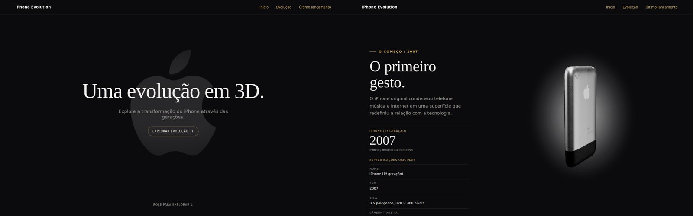
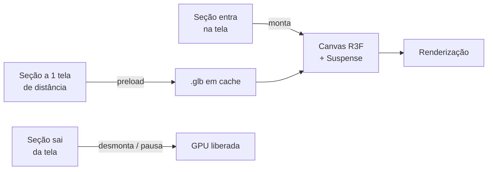

<div align="center">



# `> iPhone Evolution_`

**Da tela de 3,5" ao dobrável: a história do iPhone renderizada em tempo real no navegador.**

[](https://iphone-evolution-five.vercel.app/)


</div>

---

## `01` // Visão geral

Experiência web interativa que apresenta a evolução do iPhone por meio de **modelos 3D manipuláveis**, animações e fichas técnicas verificadas.

O projeto nasceu com um escopo amplo, com vários produtos e dezenas de cenas 3D. Durante o desenvolvimento, foi reduzido de forma deliberada aos dois extremos da história: **o primeiro iPhone (2007)** e **o iPhone Duo (2026)**. A decisão priorizou fluidez e clareza em vez de quantidade de cenas.

## `02` // Módulos da experiência

| Seção | O que você encontra |
| :-- | :-- |
| **Início** | Abertura com o logo em 3D animado e título com animação de entrada (GSAP). |
| **Evolução** | O iPhone (1ª geração) em 3D interativo, com a ficha técnica original de 2007. |
| **Último lançamento** | O iPhone Duo, primeiro iPhone dobrável, em 3D, com as especificações confirmadas pela Apple e um bloco separado para o que não foi divulgado oficialmente. |

<div align="center">

</div>

## `03` // Performance 3D

O desafio central foi manter os modelos 3D com a mesma qualidade visual sem travar o carregamento e o scroll.

### Modelos otimizados

| Modelo | Original | Otimizado | Redução |
| :-- | --: | --: | --: |
| iPhone (1ª geração) | 12,65 MB | 0,95 MB | **−92%** |
| iPhone Duo | 1,63 MB | 0,31 MB | **−81%** |
| Logo Apple | 0,39 MB | 0,01 MB | **−98%** |
| **Total** | **14,67 MB** | **1,27 MB** | **−91%** |

Pipeline aplicado com `@gltf-transform` + `meshoptimizer`: deduplicação, junção de malhas por material (menos draw calls), simplificação limitada por erro geométrico, texturas em WebP e compressão Meshopt. A comparação pixel a pixel entre originais e otimizados não mostrou diferença visual perceptível.

### Estratégia de carregamento



- **Sob demanda:** cada `<Canvas>` só existe enquanto sua seção está perto da área visível.
- **Preload antecipado:** o modelo começa a baixar uma tela antes de ser necessário.
- **Pausa fora da tela:** o logo da abertura para de renderizar quando o usuário rola a página.
- **Sombras calculadas uma vez:** a sombra de contato e o shadow map não são refeitos a cada frame, porque o modelo não se move, só a câmera.
- **DPR limitado a 1,5x:** menos pixels processados em telas retina, sem perda de nitidez perceptível.
- **Suspense:** cada modelo carrega dentro de `<Suspense>`, com indicador de progresso real do download.
- **Code splitting:** Three.js, React e GSAP em chunks separados no build, cacheados de forma independente pelo navegador.
- **Enquadramento automático:** a câmera calcula a distância pelo tamanho do modelo e pela proporção da tela, para o aparelho nunca ultrapassar a área visível, do celular ao desktop.

## `04` // Dados verificados

Nenhuma especificação é inventada. Os dados do iPhone Duo vêm das páginas oficiais de especificações e do Newsroom da Apple. Informações que a Apple não divulga, como capacidade da bateria em mAh e memória RAM, aparecem rotuladas como **"Não divulgado oficialmente"**, nunca como estimativa.

## `05` // Rodando localmente

```bash
git clone https://github.com/MilenaAmaral/iphone-evolution.git
cd iphone-evolution
npm install
npm run dev
```

| Comando | Função |
| :-- | :-- |
| `npm run dev` | Servidor de desenvolvimento (Vite) |
| `npm run build` | Build de produção em `dist/` |
| `npm run preview` | Serve o build localmente |
| `npm run check:models` | Confere se os modelos 3D ativos existem |
| `npm run optimize:models` | Regera os modelos otimizados a partir de `models-source/` (texturas WebP exigem `npm i -D sharp`) |

## `06` // Arquitetura

```text
iphone-evolution/
├── public/models/          # modelos 3D otimizados (servidos ao navegador) + MODEL_LICENSES.md
├── models-source/          # originais sem alteração, usados pelo script de otimização
├── scripts/                # otimização e verificação dos modelos
└── src/
    ├── components/
    │   ├── layout/         # navegação e rodapé
    │   ├── sections/       # Início, Evolução, Último lançamento
    │   ├── phone/          # cena 3D, modelo, iluminação, fallbacks de carregamento
    │   ├── products/       # adaptador 3D reutilizável
    │   └── shared/         # componentes de UI (ficha técnica)
    ├── data/               # especificações dos aparelhos
    ├── hooks/              # visibilidade, preload, animações
    ├── three/              # cache do GLTFLoader e descarte de recursos da GPU
    └── utils/              # qualidade gráfica por dispositivo, preferências de movimento
```

## `07` // Stack

| Camada | Tecnologia | Papel no projeto |
| :-- | :-- | :-- |
| Interface | **React 19** | Componentização e composição das seções |
| Build | **Vite 8** | Desenvolvimento, build e divisão de chunks |
| 3D | **Three.js** + **React Three Fiber** + **drei** | Cena, carregamento de GLB, controles de órbita, sombras e iluminação procedural |
| Animação | **GSAP** | Animação de entrada da abertura |
| Assets | **gltf-transform** + **meshoptimizer** | Pipeline de otimização dos modelos 3D |

## `08` // Aprendizados

- Identificar gargalos de 3D antes de reduzir qualidade: o maior ganho veio de estrutura (o que monta, quando e quantas vezes renderiza), não de piorar os modelos.
- Definir escopo como decisão técnica: menos cenas, mais bem resolvidas.
- Tratar dados técnicos com rigor de fonte, separando o confirmado do não divulgado.

---

<div align="center">

**Desenvolvido por [Milena Amaral](https://github.com/MilenaAmaral)**

<sub>Projeto independente para fins educacionais e de portfólio. iPhone e marcas relacionadas pertencem aos seus respectivos titulares. Este projeto não possui vínculo, afiliação, patrocínio ou endosso da Apple Inc. Licenças e origem dos modelos 3D em <code>public/models/MODEL_LICENSES.md</code>.</sub>

</div>
